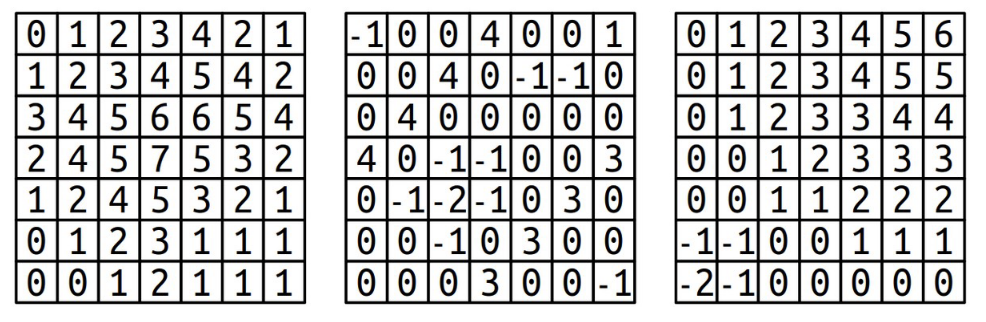
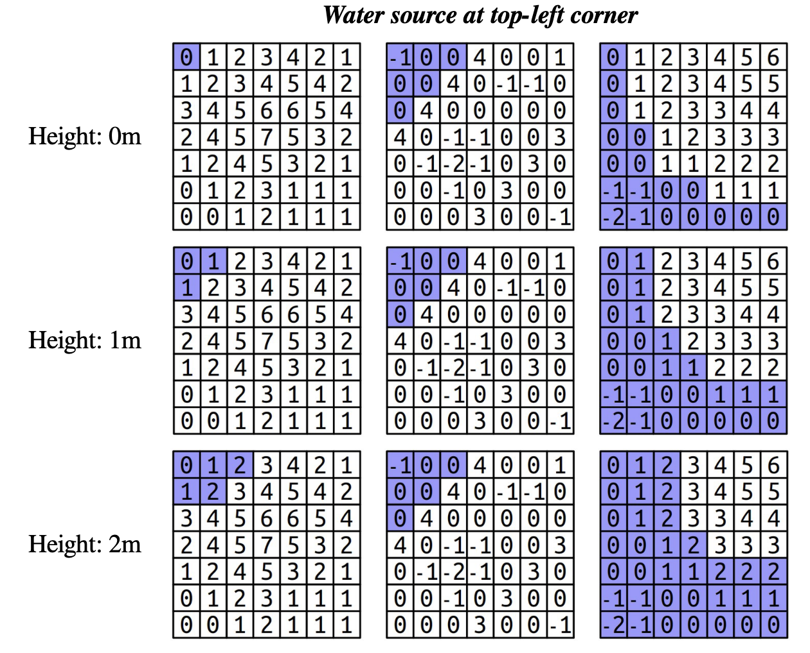
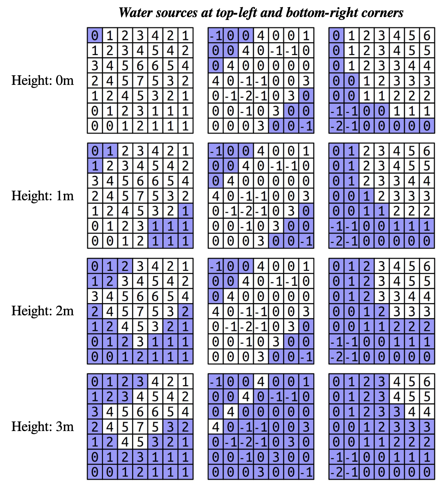
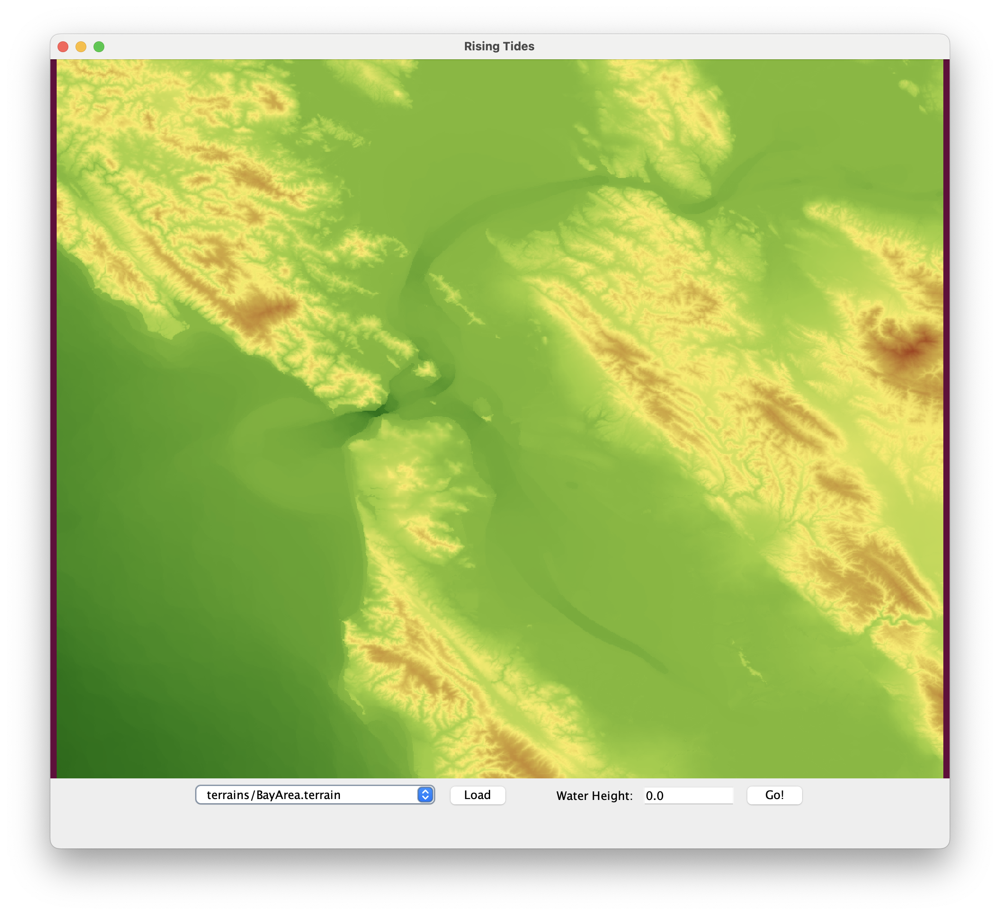
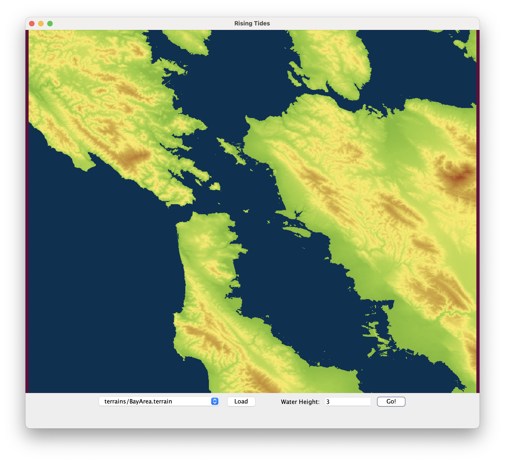
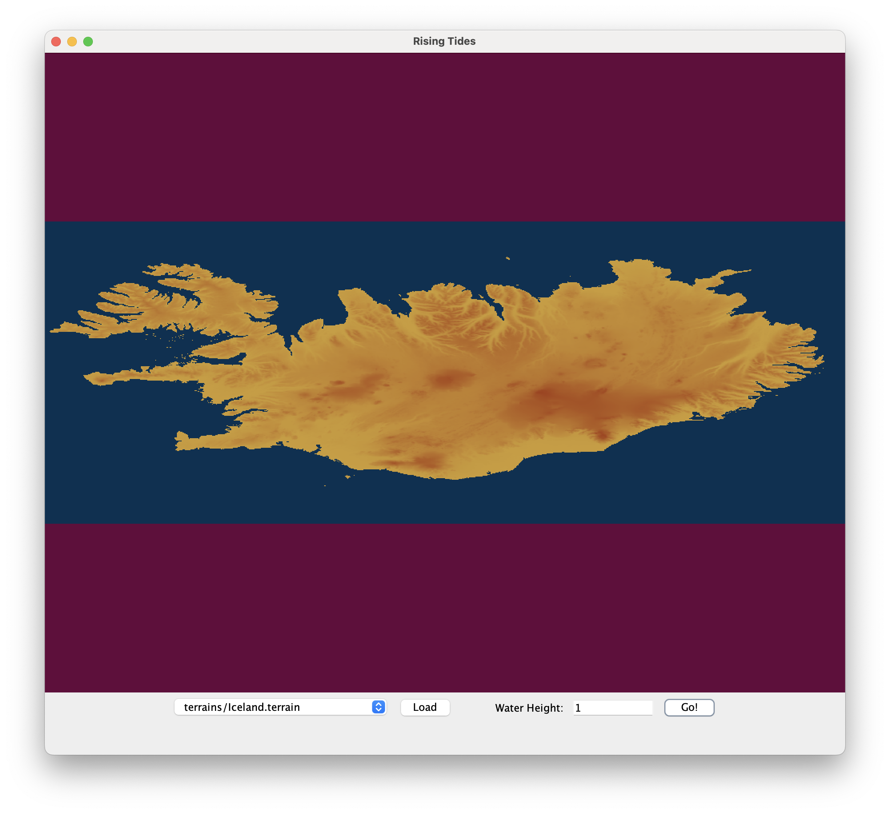
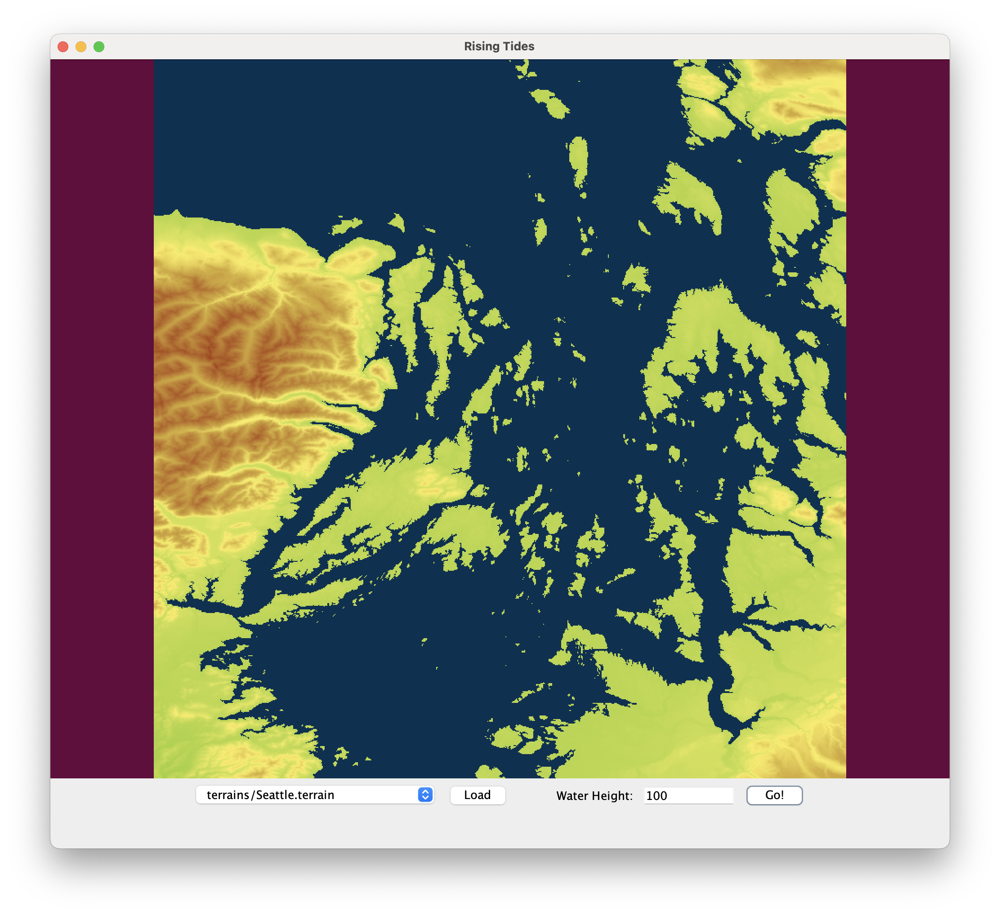

# CS62 Lab: Rising Tides 

This lab may be done in pairs or a group of 3. To summarize, your job is to write a BFS algorithm that can help us visualize the rise of tides. 

## Lab description

Global sea levels have been rising, and the most recent data suggest that the rate at which sea levels are
rising is increasing. This means that city planners in coastal areas need to start designing developments so that an extra meter of water doesn’t flood people out of their homes.

Your task in this part of the assignment is to build a tool that models flooding due to sea level rise. To do so, we’re going to model terrains as grids of doubles, where each double represents the altitude of a particular square region on Earth. Higher values indicate higher elevations, while lower values indicate lower elevations. For example, take a look at the
three grids below. Before moving on, take a minute to think over the following
questions, which you don’t need to submit.
Which picture represents a small hill?
Which one represents a long, sloping incline? Which one represents a lowland
area surrounded by levees?



We can model the flow of water as follows. We’ll imagine that there’s a water source somewhere in the
world and that we have a known height for the water. Water will then flow anywhere it can reach by moving in the four cardinal directions (up/down/left/right) without moving to a location at a higher elevation
than the initial water height. For example, suppose that the upper-left corner of each of the three above
worlds is the water source. Here’s what would be underwater given several different water heights:



A few things to notice here. First, notice that the water height is independent of the height of the terrain at its starting point. For example, in the bottom row, the water height is always two meters, even though the terrain height of the upper-left corner is either 0m or -1m, depending on the world. Second, in the terrain used in the middle column, notice that the water stays above the upper diagonal line of 4’s, since we
assume water can only move up, down, left, and right and therefore can’t move diagonally through the
gaps. Although there’s a lot of terrain below the water height, it doesn’t end up under water until the
height reaches that of the barrier.


It’s possible for a grid to have multiple water sources. This might happen, for example, if we were looking
at a zoomed-in region of the San Francisco Peninsula, we might have water to both the east and west of
the region of land in the middle, and so we’d need to account for the possibility that the water level is rising on both sides. Here’s another set of images, this time showing where the water would be in the sample
worlds above assume that both the top-left and bottom-right corner are water sources. (We’ll assume each
water source has the same height.)



Notice that the water overtops the levees in the central world, completely flooding the area, as soon as the
water height reaches three meters. The water line never changes, regardless of the current elevation. As
such, water will never flood across cells at a higher elevation than the water line, but will flood across cells
at the same height or below the water line.

Your task is to implement a function
```
public static boolean[][] floodedRegionsIn(double[][] terrain, GridLocation[] sources, double height);
```

that takes as input a terrain (given as a `double[][]`), a list of locations of water sources (represented as a `GridLocation[]`; more on `GridLocation` later), and the height of the water level, then returns a `boolean[][]` indicating, for each spot in the terrain, whether it’s under water (true) or above the water (false).

You may have noticed that we’re making use of the `GridLocation` type. This is a type representing a position in a 2D. You can create a `GridLocation` and access its row and column using this syntax:

```
GridLocation location = new GridLocation(137, 42);
System.out.println(location.row);
System.out.println(location.col);
```


Now that we’ve talked about the types involved here, let’s address how to solve this problem. How, exactly, do you determine what’s going to be underwater? Doing so requires you to determine which grid locations are both (1) below the water level and (2) places water can flow to from one of the sources.

Fortunately, there’s a beautiful algorithm you can use to solve this problem called breadth-first search.
The idea is to simulate having the water flow out from each of the sources at greater and greater distances.
First, you consider the water sources themselves. Then, you visit each location one step away from the wa-
ter sources. Then, you visit each location two steps away from the water sources, then three steps, four
steps, etc. In that way, the algorithm ends up eventually finding all places the water can flow to, and it
does so fairly quickly.

To spell out the individual steps of the algorithm, here’s some pseudocode for breadth-first search:

```
create an empty queue;
for (each water source at or below the water level) {
	flood that square;
	add that square to the queue;
}
while (the queue is not empty) {
	dequeue a position from the front of the queue;

	for (each square adjacent to the position in a cardinal direction) {
		if (that square is at or below the water level and isn't yet flooded) {
			flood that square;
			add that square to the queue;
		}
	}
}
```

As is generally the case with pseudocode, several of the operations that are expressed in English need to
be fleshed out a bit. For example, the loop that reads `for (each square adjacent to the position in a cardinal direction)`, is a conceptual description of the code that belongs there. It’s up to you to determine how to code this up;
this might be a loop, or it might be several loops, or it may be something totally different. The basic idea,
however, should still make sense. What you need to do is iterate over all the locations that are one position away from the current position. How you do that is up to you.


When you first open our starter code, `floodedRegionsIn` returns a boolean of `false` by default. When you run the main in `RisingTidesGUI.java` and select the first (bay area) map, it should give you a terrain map with no water: 



It's your job to implement `floodedRegionsIn` so the map correctly shows water as described in the check off section. Testing as you go will be helpful; we have provided small tests in the main of `RisingTides.java`.

## Java files

Your task is to fill in the blanks and implement the `floodedRegionsIn` function in `RisingTides.java`. We have given you a few unit tests in `main()` to test your implementation; make your print out is as expected. To run the visualization, run main in `RisingTidesGUI.java`. It will automatically call your implementation of `floodedRegionsIn`. 

The other files in the folder, which you do not (should not) modify, are:
- `GridLocation.java` - defining the `GridLocation` data structure
- `Terrain.java` - definining the `Terrain` data structure (not used by you, only for loading)
- `TerrainLoader.java` - loads a terrain into the GUI
- `RisingTidesVisualizer.java` - supports `RisingTidesGUI.java` with some methods 
- `terrains/` folder containing terrains to load in the GUI
- `DownloadCache/` folder to cache downloaded terrains once you load them in the GUI

**Note:** If you are unable to compile the code, try either updating your Java version, or manually typing in the types of the uncompilable lines of code.

## Check off

Push your code to Github and submit on Gradescope.

Call over an instructor or TA and show them 3 map animations: Bay Area from 0m to3m, Iceland from 0m to 1m, and Seattle from 0m to 100m. The maps should look exactly like below: 

  

Also, fill out this week's [exit ticket](https://forms.gle/Mc6nMADv2yBQy7EM6). 

Feel free to play with and visualize other terrain maps too! The provided GUI code may also be helpful if you are implementing a GUI for your final project. 


## Credits
This lab was adapated from the Rising Tides assignment by Keith Schwarz and Julie Zelenski at Stanford University. 